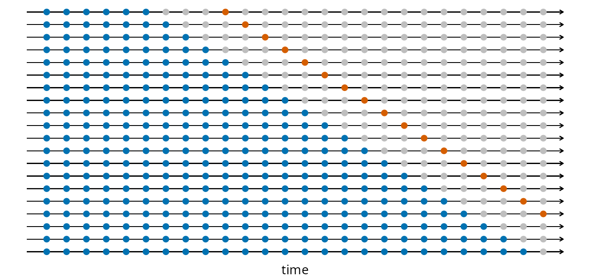

# Introduction

The World Health Organization estimated that approximately seven million people die every year due to air pollution [@CityofCapeTown2024]. To manage levels of air pollution, the City of Cape Town has built eleven air quality monitoring (AQM) stations in Cape Town. These stations collect data on particulate matter 10 $(\text{PM}_{10})$, particulate matter 2.5 $(\text{PM}_{2.5})$, sulphur dioxide $(\text{SO}_{2})$, nitrogen dioxide $(\text{NO}_{2})$, ozone $(\text{O}_{3})$, hydrogen sulphide $(\text{H}_{2}\text{S})$, carbon monoxide $(\text{CO})$, benzene $(\text{C}_{6}\text{H}_{6})$, and lead $(\text{Pb})$ [@CityofCapeTown2024]. Air pollution data for Cape Town can be found on the City of Cape Town open data portal [@CityofCapeTown2015]. 

The Table View station was chosen for this project. This is because it had the fewest missing observations. The data consist of our response variable, nitrogen dioxide $(\mu g / m^3)$, and explanatory variables, sulphur dioxide $(\mu g / m^3)$, particulate matter 10 $(\mu g / m^3)$, and wind speed $(m/s)$ from 01/01/2019 to 31/12/2019, measured hourly at the Table View station.

# Exploratory data analysis

```{r Summary statistics calculations, echo = FALSE, message = FALSE, warning = FALSE}
# Attach the required packages.
require(package = "bayesplot")
require(package = "cmdstanr")
require(package = "corrplot")
require(package = "forecast")
require(package = "ggplot2")
require(package = "kableExtra")
require(package = "knitr")
require(package = "rstan")
require(package = "parallel")
require(package = "posterior")
color_scheme_set("brightblue")


# Load the datasets.
load(file = "../objects/extracted_data_storage.RData")
load(file = "../objects/imputed_data_storage.RData")

# Extract the datasets.
X1 <- extracted_data[[1]]
X2 <- imputed_data[[1]]

# Declare variable names.
var_name <- c("DateTime", "NO2", "PM10", "SO2", "Speed")

# Declare variable names in a proper format.
x_name <- c("DateTime", 
            expression(NO[2] ~ "(" * mu * "g/m"^3 * ")"), 
            expression(PM[10] ~ "(" * mu * "g/m"^3 * ")"),
            expression(SO[2] ~ "(" * mu * "g/m"^3 * ")"), 
            expression("Wind Speed" ~ "(m/s)"))

# Calculate summary statistics.
summary_statistics <- function(X){
   rbind("Min." = sapply(X = X, FUN = min, na.rm = TRUE),
         "1st Qu." = sapply(X = X, FUN = quantile, 0.25, na.rm = TRUE),
         "Median" = sapply(X = X, FUN = median, na.rm = TRUE),
         "Mean" = sapply(X = X, FUN = mean, na.rm = TRUE),
         "SD" = sapply(X = X, FUN = sd, na.rm = TRUE),
         "3rd Qu." = sapply(X = X, FUN = quantile, 0.75, na.rm = TRUE),
         "Max." = sapply(X = X, FUN = max, na.rm = TRUE),
         "NA" = sapply(X = X, FUN = function(column) sum(is.na(column))))
}
S_mat1 <- summary_statistics(X = X1)
S_mat2 <- summary_statistics(X = X2)
```


```{r Summary statistics of the original data, echo = FALSE}
# Display summary statistics.
kable(x = round(x = t(x = S_mat1[, 2:5]), digits = 3), 
		caption = "Summary statistics of the air quality dataset from 01/01/2019 to 31/12/2019 measured hourly.")
```

All variables in this dataset are non-negative, and many observations are missing. Some of the time series models we work with cannot handle missing data directly, so we perform imputation.
Initially, we tried natural cubic splines, but some imputed values were negative because splines are unconstrained, which is problematic for non-negative variables. We then applied linear interpolation, which preserved the statistical properties of the data reasonably well. However, linear interpolation does not enforce smoothness across the time series.
To address this, we used Kalman filter-based interpolation via the `na_kalman()` function in the `imputeTS` package in `R`. This method produces smooth, non-negative estimates and is statistically optimal for estimating missing values in time series (Corey Montella). It effectively leverages the temporal structure of the data, resulting in imputed values that respect both the data’s continuity and its statistical properties. This uses a local level model, which is the simplest structural time series (state space) model.

```{r Summary statistics of the imputed data, echo = FALSE}
kable(x = round(x = t(x = S_mat2[, 2:5]), digits = 3), 
		caption = "Summary statistics of the imputed air quality dataset from 01/01/2019 to 31/12/2019.")
```

Notice that the summary statistics did not change much after applying the Kalman filter interpolation.

```{r Correlation plot of the original data, echo = FALSE, warning = FALSE, message = FALSE, fig.pos = "H", fig.width = 6, fig.height = 4, fig.cap = "Correlation plot of the air quality dataset from 01/01/2019 to 31/12/2019 measured hourly."}
# Correlation plot for the original data.
par(mfrow = c(1, 2))
cor_mat1 <- cor(X1[, 2:5], use = "na.or.complete", method = "pearson")
corrplot(corr = cor_mat1, method = "number", type = "lower")
```

Our response variable $\text{NO}_{2}$ appears to be moderately positively correlated with $\text{PM}_{10}$ and $\text{SO}_{2}$, and
moderately negatively correlated with Speed. These are not ideal explanatory variables since we
typically would like them to be strongly correlated with the response variable. The explanatory
variables are weakly correlated with one another, whether it be a positive or a negative correlation. This
is ideal since some models do not work well with correlated explanatory variables, often leading to
unstable point estimates and inflated standard errors.

```{r Correlation plot of the imputed data, echo = FALSE, warning = FALSE, message = FALSE, fig.pos = "H", fig.width = 6, fig.height = 4, fig.cap = "Correlation plot of the imputed air quality dataset from 01/01/2019 to 31/12/2019 measured hourly."}
# Correlation plot for the imputed data.
cor_mat2 <- cor(X2[, 2:5], method = "pearson")
corrplot(corr = cor_mat2, method = "number", type = "lower")
```

Notice that the correlations between variables did not change much after applying the Kalman filter interpolation.

```{r Scatter plots function, echo = FALSE}
# Function to sketch scatter plots.
draw_plots <- function(X, name){
   for(i in 2:5){
      filename <- paste0("../images/", name, "_", tolower(x = var_name[i]), ".png")
      plot(x = X$DateTime, y = X[[var_name[i]]], 
           main = "", xlab = "Time", ylab = x_name[i],
           type = "l", col = "steelblue", cex = 0.5)
   }
}
```

```{r Scatter plots of the original data, echo = FALSE, warning = FALSE, message = FALSE, fig.pos = "H", fig.cap = "Scatter plots of the air quality dataset from 01/01/2019 to 31/12/2019 measured hourly."}
# Scatter plots for the original data.
par(mfrow = c(2, 2))
draw_plots(X = X1, name = "extracted")
```

There seems to be a weak seasonal and trend component based on the time series plots. There is no clear indication of a cyclical component. There is random variation as usual. It is challenging to visually identify the time series components since this is a noisy dataset. 

```{r Scatter plots of the imputed data, echo = FALSE, warning = FALSE, message = FALSE, fig.pos = "H", fig.cap = "Scatter plots of the imputed air quality dataset from 01/01/2019 to 31/12/2019 measured hourly."}
# Scatter plots for the imputed data.
par(mfrow = c(2, 2))
draw_plots(X = X2, name = "imputed")
```

Notice that the time series plots did not change much after applying the Kalman filter interpolation.

# Model formulation

Let the window from 08/02/2019 at 00:00 to 15/02/2019 at 23:00 denote our training set (response variable $\mathbf{y}_{1}$ and design matrix $\mathbf{X}_{1}$). And let the window from 16/02/2019 at 00:00 to 16/02/2019 at 23:00 denote our test set (response variable $\mathbf{y}_{2}$ and design matrix $\mathbf{X}_{2}$).

## Simple forecasting models

`Mean`: The prediction is the average value.
The Mean method $$\hat{y}_{2_{n_{1} + h}} = \sum_{i=1}^{n_{1}} \frac{y_{1_{i}}} {n_{1}}.$$

`Naive`: The prediction is the last observed value.
The Naive method $$\hat{y}_{2_{n_{1} + h}} = y_{1_{n_{1}}}.$$

`Seasonal naive`: The prediction is the last observed value of the corresponding previous season.
The Seasonal Naive method $$\hat{y}_{2_{n_{1} + h}} = y_{1_{n_{1} + h - m (k+1)}},$$
where \(m\) is the seasonal period and \(k = \lfloor \frac{h-1}{m} \rfloor\).  

`Drift`: The prediction is the last observed value adjusted for the average trend.
The Drift method $$\hat{y}_{2_{n_{1} + h}} = y_{1_{n_{1}}} + h \left(\frac{y_{1_{{n_{1}}}} - y_{1_{1}}} {n_{1} - 1} \right).$$

## AR(1)

`AR(1)`: The prediction is based on a constant, plus a fraction of the previous value.
The AR(1) model $$\hat{y}_{2_{n_{1} + h}} = c + \phi y_{1_{n_{1}}}.$$

```{r Load the data, echo = FALSE}
# Load the dataset.
load(file = "../objects/window_data_storage.RData")
```

```{r Simple forecasting models, echo = FALSE, message = FALSE, warning = FALSE}
R_mat <- matrix(data = NA, nrow = 3, ncol = 6, 
                dimnames = list(c("RMSE", "MAE", "MAPE"), 
                                c("Mean", "Naive", "Seasonal naive", "Drift", "AR(1)", "Gaussian process")))

# Fit the model(s).
mean_fit <- meanf(y = y1, h = h)
naive_fit <- naive(y = y1, h = h)
snaive_fit <- snaive(y = y1, h = h)
drift_fit <- rwf(y = y1, h = h, drift = TRUE)
arima_obj <- arima(x = y1, order = c(1, 0, 0))
arima_fit <- forecast(object = arima_obj, h = h)

# Calculate the mean square error.
R_mat[1, 1] <- sqrt(mean((mean_fit$mean - y2)^2))
R_mat[1, 2] <- sqrt(mean((naive_fit$mean - y2)^2))
R_mat[1, 3] <- sqrt(mean((snaive_fit$mean - y2)^2))
R_mat[1, 4] <- sqrt(mean((drift_fit$mean - y2)^2))
R_mat[1, 5] <- sqrt(mean((arima_fit$mean - y2)^2))

# Calculate the mean absolute error.
R_mat[2, 1] <- mean(abs(mean_fit$mean - y2))
R_mat[2, 2] <- mean(abs(naive_fit$mean - y2))
R_mat[2, 3] <- mean(abs(snaive_fit$mean - y2))
R_mat[2, 4] <- mean(abs(drift_fit$mean - y2))
R_mat[2, 5] <- mean(abs(arima_fit$mean - y2))

# Calculate the mean absolute percentage error.
R_mat[3, 1] <- mean((abs(mean_fit$mean - y2) / abs(y2)) * 100)
R_mat[3, 2] <- mean((abs(naive_fit$mean - y2) / abs(y2)) * 100)
R_mat[3, 3] <- mean((abs(snaive_fit$mean - y2) / abs(y2)) * 100)
R_mat[3, 4] <- mean((abs(drift_fit$mean - y2) / abs(y2)) * 100)
R_mat[3, 5] <- mean((abs(arima_fit$mean - y2) / abs(y2)) * 100)

# Plot the forecasts.
p2 <- p2 + autolayer(object = mean_fit, series = "Mean", PI = FALSE)
p2 <- p2 + autolayer(object = naive_fit, series = "Naive", PI = FALSE)
p2 <- p2 + autolayer(object = snaive_fit, series = "Snaive", PI = FALSE)
p2 <- p2 + autolayer(object = drift_fit, series = "Drift", PI = FALSE)
p2 <- p2 + autolayer(object = arima_fit, series = "AR(1)", PI = FALSE)
```

## Gaussian process

Linear mean function:
$$m(x_{i}) = \sum_{j=1}^{p} x_{ij}\beta_{j}, \quad \text{where} \quad i \in \{1,\, \ldots,\, \text{n}\}.$$
The resulting mean vectors of the training set and test set respectively are as follows.
$$\mathbf{m}_{1} = \mathbf{X}_{1}\boldsymbol{\beta}, \quad \mathbf{m}_{2} = \mathbf{X}_{2}\boldsymbol{\beta}$$
Squared-exponential kernel:
$$k(x_{i},\, x_{j}) = \alpha^2 \text{exp} \bigg(-\frac{(x_{i} - x_{j})^2}{2\rho^2} \bigg) + \delta\text{I}_{i=j}, \, \text{where} \, \alpha,\, \rho \text{ are hyperparameters and } \delta = 1\text{e}-9.$$
The resulting covariance matrices are as follows
$$\mathbf{K}_{11} = k(\mathbf{X}_{1},\, \mathbf{X}_{1}) + \delta\mathbf{I}_{n_{1}}$$
$$\mathbf{K}_{12} = k(\mathbf{X}_{1},\, \mathbf{X}_{2})$$
$$\mathbf{K}_{22} = k(\mathbf{X}_{2},\, \mathbf{X}_{2}) + \delta\mathbf{I}_{n_{2}}$$
The likelihood is the following.
$$\mathbf{y}_{1}|\, \boldsymbol{\beta}, \alpha, \rho \sim \mathcal{N}(\mathbf{m}_{1},\, \mathbf{K}_{11})$$

Choosing the following priors.
$$\boldsymbol{\beta} \sim \mathcal{N}(0,\, \mathbf{I}_{p})$$
$$\alpha \sim \text{half-normal}(0, 1)$$
$$\rho \sim \text{half-normal}(24,\, 12)$$
The joint distribution of $[\mathbf{y}_{1},\, \mathbf{y}_{2}]$ given fixed parameters $(\boldsymbol{\beta},\, \alpha,\, \rho)$, the joint distribution of the training and set outputs is a multivariate normal:
$$\begin{bmatrix} \mathbf{y}_{1} \\ \mathbf{y}_{2} \end{bmatrix} \sim \mathcal{N} \Bigg(\begin{bmatrix} \mathbf{m}_{1} \\ \mathbf{m}_{2} \end{bmatrix},\, \begin{bmatrix} \mathbf{K}_{11} & \mathbf{K}_{12} \\ \mathbf{K}_{21} & \mathbf{K}_{22} \end{bmatrix} \Bigg).$$
The conditional distribution of $\mathbf{y}_{2}|\, \mathbf{y}_{1},\, \boldsymbol{\beta},\, \alpha,\, \rho$. This is just a conditional distribution of a multivariate normal distribution which is a well known result.
$$\mathbf{y}_{2}|\, \mathbf{y}_{1},\, \boldsymbol{\beta},\, \alpha,\, \rho \sim \mathcal{N}(\mathbf{m}_{2} + \mathbf{K}_{12}^{\text{T}}\mathbf{K}_{11}^{-1}(\mathbf{y}_{1} - \mathbf{m}_{1}),\, \mathbf{K}_{22} - \mathbf{K}_{12}^{\text{T}} \mathbf{K}_{11}^{-1} \mathbf{K}_{12})$$
$$\pi(\mathbf{y}_{2}|\, \mathbf{y}_{1}) = \int \pi(\mathbf{y}_{2}|\, \mathbf{y}_{1},\, \boldsymbol{\beta},\, \alpha,\, \rho) \, \pi(\boldsymbol{\beta}) \, \pi(\alpha) \, \pi(\rho) \,  d\boldsymbol{\beta}\, d\alpha\, d\rho.$$
This does not have a closed form solution. We approximated the posterior samples of this distribution using `Stan`. `Stan` avoids computing explicit inverses. These quantities are calculated in `Stan` as follows.

Cholesky decomposition of $\mathbf{K}_{11}$. 
$$\mathbf{K}_{11} = \mathbf{L} \mathbf{L}^{\text{T}}.$$

Compute $\mathbf{w} = \mathbf{K}_{11}^{-1}(\mathbf{y}_{1} - \mathbf{m}_{1})$ via triangular solves:
$$\mathbf{v} = \mathbf{L}^{-1}(\mathbf{y}_{1} - \mathbf{m}_{1}).$$
Then $$\mathbf{w} = (\mathbf{L}^{\text{T}})^{-1} \mathbf{v}.$$
Thus $$\mathbf{w} = \mathbf{K}_{11}^{-1}(\mathbf{y}_{1} - \mathbf{m}_{1}).$$

The predictive mean is calculated as follows. 

$$\mathbf{m}_{2} + \mathbf{K}_{12}^{\text{T}}\mathbf{w} = \mathbf{m}_{2} + \mathbf{K}_{12}^{\text{T}}\mathbf{K}_{11}^{-1}(\mathbf{y}_{1} - \mathbf{m}_{1}).$$
And the predictive covariance is calculated as follows.

$$\mathbf{A} = \mathbf{L}^{-1} \mathbf{K}_{12}.$$
Then $$\mathbf{A}^{\text{T}} \mathbf{A} = \mathbf{K}_{12}^{\text{T}} \mathbf{L}^{-\text{T}} \mathbf{L}^{-1} \mathbf{K}_{12}.$$
Thus $$\mathbf{A}^{\text{T}} \mathbf{A} = \mathbf{K}_{12}^{\text{T}} \mathbf{K}_{11}^{-1} \mathbf{K}_{12}.$$

Then draw samples from $\mathbf{y}_{2}|\, \mathbf{y}_{1}$ via Hamiltonian Monte Carlo (HMC) in `Stan`. The algorithm proceeds as follows.

1. `Stan` samples the parameters $(\boldsymbol{\beta},\, \alpha,\, \rho)$ from the posterior distribution $\pi(\boldsymbol{\beta},\, \alpha,\, \rho|\, \mathbf{y}_{1})$ using HMC.

2. For each parameter draw `Stan` then executes the `generated quantities` block which:
- Computes the predictive mean and predictive covariance,
- draws $$\mathbf{y}_{2}^{(s)} \sim \mathcal{N}(\text{pred mean},\, \text{pred covariance})$$ using `multi_normal_rng`. 
	The RNG draw is not part of the HMC dynamics - it happens after the sampler proposes/accepts a parameter sample.

3. Collecting the $\mathbf{y}_{2}^{(s)}$ across all saved iterations gives a Monte Carlo approximation to the marginal posterior predictive $$\pi(\mathbf{y}_{2}|\, y_{1}) \approx \frac{1}{S} \sum_{s=1}^{S} \mathcal{N}(\mathbf{y}_{2}|\, \mu^{(s)},\, \Sigma^{(s)}),$$ where $\mu^{(s)},\, \Sigma^{(s)}$ are conditional mean/covariance computed at the $s$-th parameter draw.

```{r, echo = FALSE, message = FALSE, warning = FALSE, cache = TRUE}
cores_number <- detectCores() - 2
stan_data <- list(X1 = X1, y1 = y1, n1 = n1, p = p, X2 = X2, n2 = n2)

# Compile Stan model once.
mod <- cmdstan_model(stan_file = "squared_exponential.stan")

# Sample from a Gaussian process.
fit <- mod$sample(
	data = stan_data,
   chains = 4,
   parallel_chains = cores_number,
   seed = 2025,
   refresh = 0,
   show_messages = FALSE,
	show_exceptions = FALSE)

# fit is a CmdStanMCMC object.
y2_draws <- fit$draws("y2", format = "matrix")
y2_mean  <- colMeans(y2_draws)

y2_hat <- ts(y2_mean, start = start(y2), frequency = frequency(y2))
```

## Model comparison statistics

```{r Model comparizin statistics, echo = FALSE, message = FALSE, warning = FALSE}
# Calculate the error.
R_mat[1, 6] <- sqrt(mean((y2_hat - y2)^2))
R_mat[2, 6] <- mean(abs(y2_hat - y2))
R_mat[3, 6] <- mean((abs(y2_hat - y2) / abs(y2)) * 100)
kable(x = t(round(x = R_mat, digits = 3)), 
		caption = "Average performance of the fitted models on the out-of-sample period 16/02/2019 00:00 to 16/02/2019 23:00.")
```

## Model comparison plots

```{r Model comparison plots, echo = FALSE, message = FALSE, warning = FALSE, fig.width = 6, fig.height = 4, fig.cap = "Time series of the fitted models on the out-of-sample period 06/02/2019 00:00 to 06/02/2019 23:00."}
# Plot the forecasts.
p2 <- p2 + autolayer(object = y2_hat, series = "Gaussian process")
p2
```

## Cross validation

Cross-validation was conducted as follows: a period of 7 days from 08/02/2019 at 00:00 to 15/02/2019 at 23:00 was used for the training set, and one hour on 16/02/2019 at 00:00 was used as a test set. On each iteration, we increment the training set and shift the test set by one time point, after which loss functions (MSE, MAE, and MAPE) are calculated and stored in a matrix. Once all ten iterations are completed, the error functions are averaged over all iterations.



```{r Cross validation, echo = FALSE, message = FALSE, warning = FALSE, eval = FALSE}
h <- 1
R_list <- list()
R_mat <- matrix(data = NA, nrow = 3, ncol = 5, 
					 dimnames = list(c("IRMSE", "IMAE", "IMPE"), 
					 					 c("Mean", "Naive", "Seasonal naive", "Drift", "Gaussian process")))
n2 <- 1
for(i in 1:n2){
	# Fit the model(s).
	mean_fit <- meanf(y = y1, h = h)
	naive_fit <- naive(y = y1, h = h)
	snaive_fit <- snaive(y = y1, h = h)
	drift_fit <- rwf(y = y1, h = h, drift = TRUE)
	stan_data <- list(X1 = X1, y1 = y1, n1 = n1, p = p, 
							X2 = matrix(data = X2[i, ], nrow = 1), n2 = h)
	# Sample from a Gaussian process.
	fit <- mod$sample(
		data = stan_data,
	   chains = 4,
	   parallel_chains = cores_number,
	   seed = 2025,
	   refresh = 0,
	   show_messages = FALSE,
		show_exceptions = FALSE)
	
	# fit is a CmdStanMCMC object.
	y2_draws <- fit$draws("y2", format = "matrix")
	y2_mean  <- colMeans(y2_draws)
	y2_hat <- as.numeric(y2_mean)
	
	# Calculate the mean square error.
	R_mat[1, 1] <- sqrt(mean((mean_fit$mean - y2[i])^2))
	R_mat[1, 2] <- sqrt(mean((naive_fit$mean - y2[i])^2))
	R_mat[1, 3] <- sqrt(mean((snaive_fit$mean - y2[i])^2))
	R_mat[1, 4] <- sqrt(mean((drift_fit$mean - y2[i])^2))
	R_mat[1, 5] <- sqrt(mean((y2_hat - y2[i])^2))
	
	# Calculate the mean absolute error.
	R_mat[2, 1] <- mean(abs(mean_fit$mean - y2[i]))
	R_mat[2, 2] <- mean(abs(naive_fit$mean - y2[i]))
	R_mat[2, 3] <- mean(abs(snaive_fit$mean - y2[i]))
	R_mat[2, 4] <- mean(abs(drift_fit$mean - y2[i]))
	R_mat[2, 5] <- mean(abs(y2_hat - y2[i]))
	
	# Calculate the mean absolute percentage error.
	R_mat[3, 1] <- mean((abs(mean_fit$mean - y2[i]) / abs(y2[i])) * 100)
	R_mat[3, 2] <- mean((abs(naive_fit$mean - y2[i]) / abs(y2[i])) * 100)
	R_mat[3, 3] <- mean((abs(snaive_fit$mean - y2[i]) / abs(y2[i])) * 100)
	R_mat[3, 4] <- mean((abs(drift_fit$mean - y2[i]) / abs(y2[i])) * 100)
	R_mat[3, 5] <- mean((abs(y2_hat - y2[i]) / abs(y2[i])) * 100)
	
	# Store the errors for the current iteration.
	R_list[[i]] <- R_mat
	
	# Update the training set for the next iteration.
	X1 <- rbind(X1, X2[i, , drop = FALSE])
	y1 <- c(y1, y2[i])
	n1 <- n1 + 1
}
```

```{r Cross validation statistics, echo = FALSE, message = FALSE, warning = FALSE, eval = FALSE}
R_mat <- apply(X = simplify2array(x = R_list), MARGIN = c(1, 2), FUN = mean)

kable(x = t(round(x = R_mat, digits = 3)),
		caption = "Average out-of-sample performance of the fitted models over 10 one-step-ahead test points.")
```

# Appendix

```{r Appendix, echo = TRUE, eval = FALSE}
# Attach the required packages.
require(package = "bayesplot")
require(package = "cmdstanr")
require(package = "corrplot")
require(package = "forecast")
require(package = "ggplot2")
require(package = "kableExtra")
require(package = "knitr")
require(package = "rstan")
require(package = "parallel")
require(package = "posterior")
color_scheme_set("brightblue")


# Load the datasets.
load(file = "../objects/extracted_data_storage.RData")
load(file = "../objects/imputed_data_storage.RData")

# Extract the datasets.
X1 <- extracted_data[[1]]
X2 <- imputed_data[[1]]

# Declare variable names.
var_name <- c("DateTime", "NO2", "PM10", "SO2", "Speed")

# Declare variable names in a proper format.
x_name <- c("DateTime", 
            expression(NO[2] ~ "(" * mu * "g/m"^3 * ")"), 
            expression(PM[10] ~ "(" * mu * "g/m"^3 * ")"),
            expression(SO[2] ~ "(" * mu * "g/m"^3 * ")"), 
            expression("Wind Speed" ~ "(m/s)"))

# Calculate summary statistics.
summary_statistics <- function(X){
   rbind("Min." = sapply(X = X, FUN = min, na.rm = TRUE),
         "1st Qu." = sapply(X = X, FUN = quantile, 0.25, na.rm = TRUE),
         "Median" = sapply(X = X, FUN = median, na.rm = TRUE),
         "Mean" = sapply(X = X, FUN = mean, na.rm = TRUE),
         "SD" = sapply(X = X, FUN = sd, na.rm = TRUE),
         "3rd Qu." = sapply(X = X, FUN = quantile, 0.75, na.rm = TRUE),
         "Max." = sapply(X = X, FUN = max, na.rm = TRUE),
         "NA" = sapply(X = X, FUN = function(column) sum(is.na(column))))
}
S_mat1 <- summary_statistics(X = X1)
S_mat2 <- summary_statistics(X = X2)

# Display summary statistics.
kable(x = round(x = t(x = S_mat1[, 2:5]), digits = 3), 
		caption = "Summary statistics of the air quality dataset from 01/01/2019 to 31/12/2019 measured hourly.")

kable(x = round(x = t(x = S_mat2[, 2:5]), digits = 3), 
		caption = "Summary statistics of the imputed air quality dataset from 01/01/2019 to 31/12/2019.")

# Correlation plot for the original data.
par(mfrow = c(1, 2))
cor_mat1 <- cor(X1[, 2:5], use = "na.or.complete", method = "pearson")
corrplot(corr = cor_mat1, method = "number", type = "lower")

# Correlation plot for the imputed data.
cor_mat2 <- cor(X2[, 2:5], method = "pearson")
corrplot(corr = cor_mat2, method = "number", type = "lower")

# Function to sketch scatter plots.
draw_plots <- function(X, name){
   for(i in 2:5){
      filename <- paste0("../images/", name, "_", tolower(x = var_name[i]), ".png")
      plot(x = X$DateTime, y = X[[var_name[i]]], 
           main = "", xlab = "Time", ylab = x_name[i],
           type = "l", col = "steelblue", cex = 0.5)
   }
}

# Scatter plots for the original data.
par(mfrow = c(2, 2))
draw_plots(X = X1, name = "extracted")

# Scatter plots for the imputed data.
par(mfrow = c(2, 2))
draw_plots(X = X2, name = "imputed")

# Load the dataset.
load(file = "../objects/window_data_storage.RData")


R_mat <- matrix(data = NA, nrow = 3, ncol = 6, 
                dimnames = list(c("RMSE", "MAE", "MAPE"), 
                                c("Mean", "Naive", "Seasonal naive", "Drift", "AR(1)", "Gaussian process")))

# Fit the model(s).
mean_fit <- meanf(y = y1, h = h)
naive_fit <- naive(y = y1, h = h)
snaive_fit <- snaive(y = y1, h = h)
drift_fit <- rwf(y = y1, h = h, drift = TRUE)
arima_obj <- arima(x = y1, order = c(1, 0, 0))
arima_fit <- forecast(object = arima_obj, h = h)

# Calculate the mean square error.
R_mat[1, 1] <- sqrt(mean((mean_fit$mean - y2)^2))
R_mat[1, 2] <- sqrt(mean((naive_fit$mean - y2)^2))
R_mat[1, 3] <- sqrt(mean((snaive_fit$mean - y2)^2))
R_mat[1, 4] <- sqrt(mean((drift_fit$mean - y2)^2))
R_mat[1, 5] <- sqrt(mean((arima_fit$mean - y2)^2))

# Calculate the mean absolute error.
R_mat[2, 1] <- mean(abs(mean_fit$mean - y2))
R_mat[2, 2] <- mean(abs(naive_fit$mean - y2))
R_mat[2, 3] <- mean(abs(snaive_fit$mean - y2))
R_mat[2, 4] <- mean(abs(drift_fit$mean - y2))
R_mat[2, 5] <- mean(abs(arima_fit$mean - y2))

# Calculate the mean absolute percentage error.
R_mat[3, 1] <- mean((abs(mean_fit$mean - y2) / abs(y2)) * 100)
R_mat[3, 2] <- mean((abs(naive_fit$mean - y2) / abs(y2)) * 100)
R_mat[3, 3] <- mean((abs(snaive_fit$mean - y2) / abs(y2)) * 100)
R_mat[3, 4] <- mean((abs(drift_fit$mean - y2) / abs(y2)) * 100)
R_mat[3, 5] <- mean((abs(arima_fit$mean - y2) / abs(y2)) * 100)

# Plot the forecasts.
p2 <- p2 + autolayer(object = mean_fit, series = "Mean", PI = FALSE)
p2 <- p2 + autolayer(object = naive_fit, series = "Naive", PI = FALSE)
p2 <- p2 + autolayer(object = snaive_fit, series = "Snaive", PI = FALSE)
p2 <- p2 + autolayer(object = drift_fit, series = "Drift", PI = FALSE)
p2 <- p2 + autolayer(object = arima_fit, series = "AR(1)", PI = FALSE)

cores_number <- detectCores() - 2
stan_data <- list(X1 = X1, y1 = y1, n1 = n1, p = p, X2 = X2, n2 = n2)

# Compile Stan model once.
mod <- cmdstan_model(stan_file = "squared_exponential.stan")

# Sample from a Gaussian process.
fit <- mod$sample(
	data = stan_data,
   chains = 4,
   parallel_chains = cores_number,
   seed = 2025,
   refresh = 0,
   show_messages = FALSE,
	show_exceptions = FALSE)

# fit is a CmdStanMCMC object.
y2_draws <- fit$draws("y2", format = "matrix")
y2_mean  <- colMeans(y2_draws)

y2_hat <- ts(y2_mean, start = start(y2), frequency = frequency(y2))

# Calculate the error.
R_mat[1, 6] <- sqrt(mean((y2_hat - y2)^2))
R_mat[2, 6] <- mean(abs(y2_hat - y2))
R_mat[3, 6] <- mean((abs(y2_hat - y2) / abs(y2)) * 100)
kable(x = t(round(x = R_mat, digits = 3)), 
		caption = "Average performance of the fitted models on the out-of-sample period 16/02/2019 00:00 to 16/02/2019 23:00.")

# Plot the forecasts.
p2 <- p2 + autolayer(object = y2_hat, series = "Gaussian process")
p2
```

```{stan, echo = TRUE, eval = FALSE, output.var="gp_model"}
functions {
  matrix se_kernel(matrix X1, matrix X2, real alpha, real rho) {
    int n1 = rows(X1);
    int n2 = rows(X2);
    matrix[n1, n2] K;

    for (i in 1:n1) {
      for (j in 1:n2) {
        // squared Euclidean distance between rows i and j
        real sqdist = dot_self(X1[i] - X2[j]);
        K[i, j] = square(alpha) * exp(-0.5 * sqdist / square(rho));
      }
    }
    return K;
  }
}

data {
  int<lower=1> n1;
  int<lower=1> p;
  matrix[n1, p] X1;
  vector[n1] y1;

  int<lower=1> n2;
  matrix[n2, p] X2;
}

transformed data {
  real delta = 1e-9;
}

parameters {
  real<lower=0> alpha;
  real<lower=0> rho;
  vector[p] beta;
}

model {
  // Priors
  alpha ~ normal(0, 1);
  rho ~ normal(24, 12); // half-normal since <lower=0>
  beta ~ normal(0, 1);

  // Build covariance for training
  matrix[n1, n1] K11 = se_kernel(X1, X1, alpha, rho)
                       + diag_matrix(rep_vector(delta, n1));
  vector[n1] mu1 = X1 * beta;

  // Likelihood
  y1 ~ multi_normal(mu1, K11);
}

generated quantities {
  vector[n2] y2;

  // Covariance blocks
  matrix[n1, n1] K11 = se_kernel(X1, X1, alpha, rho)
                       + diag_matrix(rep_vector(delta, n1));
  matrix[n1, n2] K12 = se_kernel(X1, X2, alpha, rho);
  matrix[n2, n2] K22 = se_kernel(X2, X2, alpha, rho)
                       + diag_matrix(rep_vector(delta, n2));

  // Means
  vector[n1] mu1 = X1 * beta;
  vector[n2] mu2 = X2 * beta;

  // Cholesky factor of K11
  matrix[n1, n1] L = cholesky_decompose(K11);

  // Predictive mean
  vector[n1] y1_centered = y1 - mu1;
  vector[n1] v = mdivide_left_tri_low(L, y1_centered);
  vector[n1] w = mdivide_right_tri_low(v', L)';
  vector[n2] pred_mean = mu2 + K12' * w;

  // Predictive covariance
  matrix[n1, n2] A = mdivide_left_tri_low(L, K12);
  matrix[n2, n2] pred_cov = K22 - A' * A;

  // Draw sample
  y2 = multi_normal_rng(pred_mean, pred_cov);
}
```
# References
